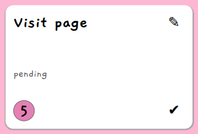
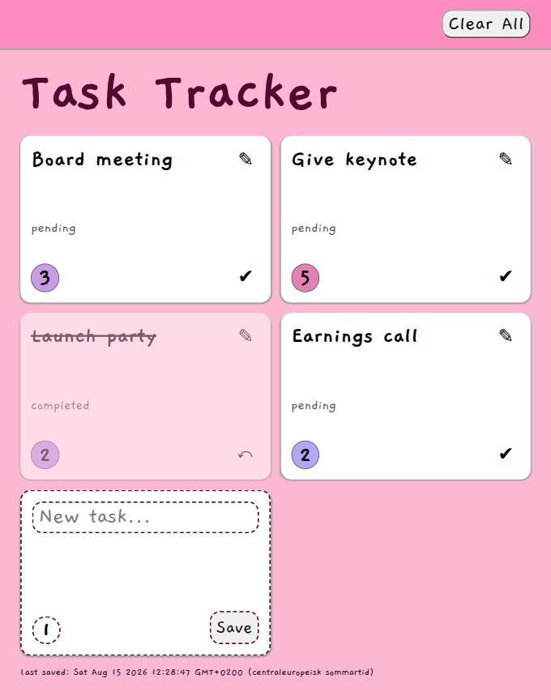
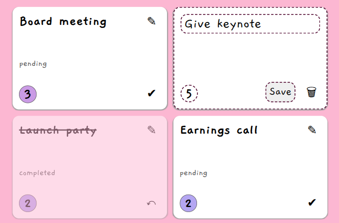

# Task Tracker

A simple task tracker app for managing and prioritising tasks. This project was my first introduction to TypeScript as part of the Lexicon frontend education. 

## :star: Features
- Add, edit and delete tasks
- Prioritise tasks
- Toggle complete/pending
- Tasks saved in local storage between sessions
- responsive design from small to large screen sizes
- accessible design
- keyboard focus maintained across page renders
- dark and light themes

## :eye: Demo
[](https://josiefinis.github.io/task-tracker/)

## :camera: Screenshots

Example tasks in the app, showing pending and completed tasks of various priorities, 
and the *new task* form.

---

Editing a task.

---

## :wheel: Under the hood
- TypeScript DOM manipulation 
- Event listeners
- Local storage
- Forms and validation
- Modules
- TypeScript typing

## :sewing_needle: Technologies
- Typescript


## :open_file_folder: Project structure
The app source code is organised into modules as below. 
```text
./
  ├ index.html
  └ src/
      ├ cards.ts
      ├ edit-task-form.ts
      ├ local-storage.ts
      ├ main.ts
      ├ new-task-form.ts
      ├ render.ts
      ├ tasks.ts
      ├ types.ts
      └ utils.ts
```

## :bug: Known Issues
- No focus trap when editing a task


## :mortar_board: Lexicon
This project was part of the frontend education with Lexicon. Previous and subsequent projects can be found below.

- [Bara Pannkakor (HTML & CSS)](https://github.com/josiefinis/recept)
- [Evently (HTML & CSS)](https://github.com/josiefinis/Evently-2026)
- **Task Tracker (Typescript)**
- [Async Practice (Typescript)](https://github.com/josiefinis/async-practice)
- [Josifinix (Next.js, React, TypeScript & Tailwind)](https://github.com/josiefinis/intro-nextjs)
- [Webshop (Agile, GitHub Projects, Next.js, React, TypeScript & Tailwind)](https://github.com/Martin-Joensson/projekt-agila-metoder-webshop)

## :bust_in_silhouette: Author
Josefin Wall ([@josiefinis](https://github.com/josiefinis))
